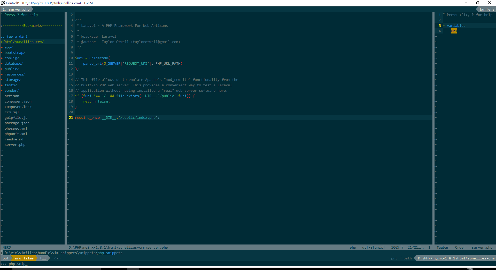

### 便携版vim
1. vim80加入PATH
2. 需要python2支持（ 加入PATH）
3. 需要git 并加入PATH
4. _vimrc配置里有几处需要配置浏览器目录 **web服务器目录**
5. js语法检测，需要nodejs支持，在vim80下，安装npm i jshint
6. vim8.0升级后，好像不支持透明度、窗口置顶了

#### 注意点
1. git上的php-cs-fixer缺少了vim文件(http: //cs.sensiolabs.org/)
2. *auth-info ftplugin文件夹不识别， 需要改成 plugin*

